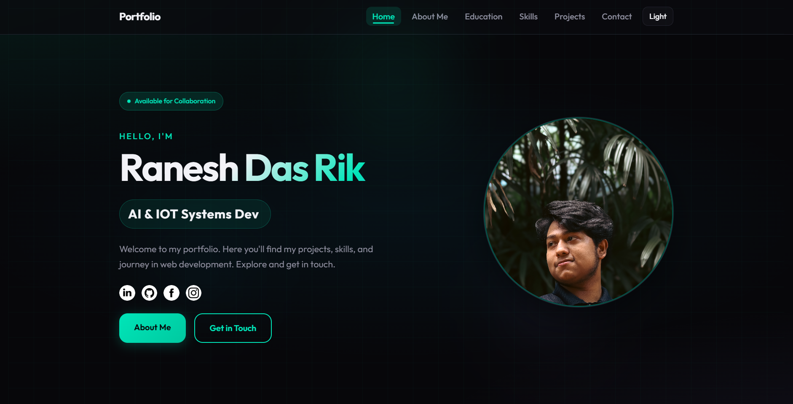

<div align="center">

#  Student Portfolio Website 

**—** *A modern, responsive multi-page portfolio built with vanilla HTML5, CSS3, and JavaScript* **—**

*No frameworks · No build step · Just clean, semantic markup*

</div>

<p align="center">
  
</p>

---

## 🎯 Overview

This portfolio showcases education, skills, projects, and contact in a single cohesive site. It features a **dark/light theme**, smooth **scroll-reveal** animations, a **typewriter** hero, **contact form validation**, and a **first-visit loading screen**—all implemented with plain JavaScript and CSS.

Perfect for students and developers who want a fast, accessible, and easy-to-customize portfolio without dependencies.

---

## ✨ Features

| Feature | Description |
|--------|-------------|
| **🌓 Theme Toggle** | Dark (default) and light themes with preference saved in `localStorage` |
| **📱 Responsive** | Mobile-first layout with hamburger nav and breakpoints for all screen sizes |
| **⌨️ Typewriter Hero** | Rotating role titles with type/delete animation on the homepage |
| **🎬 Page Loader** | Ball-style loading animation on first visit (skipped on subsequent navigation via `sessionStorage`) |
| **👁️ Scroll Reveal** | Sections and cards animate into view on scroll via `IntersectionObserver` |
| **📊 Skill Bars** | Animated skill bars that fill when they enter the viewport |
| **📝 Contact Form** | Client-side validation (name, email, message) with inline errors and success feedback |
| **🔘 Button Ripples** | Click ripple effect on primary/secondary buttons |
| **⬆️ Scroll-to-Top** | Floating button appears after scrolling; smooth scroll back to top |
| **♿ Accessibility** | Semantic HTML, ARIA labels, focus styles, and keyboard-friendly navigation |
| **🎨 Custom Scrollbar** | Themed scrollbar (accent color) for a cohesive look |

---

## 🛠️ Tech Stack

- **HTML5** — Semantic structure, `aria-*` attributes, `loading="lazy"` for images
- **CSS3** — Custom properties (variables), Flexbox/Grid, transitions, media queries
- **Vanilla JavaScript** — No libraries; theme, nav, form, animations, and UX logic in one file
- **Fonts** — [Google Fonts](https://fonts.google.com): **Outfit** (UI), **JetBrains Mono** (accents)

---

## 📁 Project Structure

```
Student_Portfolio_Website/
├── index.html          # Home — hero, typewriter, CTA, social links
├── about.html          # About Me — profile, stats, story, focus areas
├── education.html      # Education — timeline (RUET, HSC, SSC)
├── skills.html         # Skills — technical + tools + soft skills with bars
├── projects.html       # Projects — VisionGuard51, PONG QUEST, portfolio, surprise site, build log
├── contact.html        # Contact — form (name, email, message) + validation
├── css/
│   └── style.css       # Global styles, theme variables, components, responsive
├── js/
│   └── script.js       # Theme, nav, form, skill bars, reveal, ripple, scroll-top, loader, typewriter
├── images/
│   ├── profile_image1.jpg    # Hero profile photo
│   ├── about_image.jpg       # About section photo
│   ├── social/               # LinkedIn, GitHub, Facebook, Instagram icons
│   ├── skills/               # Skill icons (HTML5, CSS3, JS, Python, etc.)
│   ├── tools/                # Tool icons (VS Code, Git, Firebase, etc.)
│   └── projects/             # Project screenshots and media
└── README.md
```

---

## 📄 Pages at a Glance

| Page | Content |
|------|--------|
| **Home** | Hero with name, typewriter roles, short intro, social links, and CTAs (About Me / Get in Touch). |
| **About Me** | Profile (name, degree, university, location), bio, “focused on” and “building next” lists, and “outside of coding.” |
| **Education** | Timeline: RUET (B.Sc. ETE, 2023–Present), HSC, SSC with years and results. |
| **Skills** | Technical skills with progress bars; tools and soft skills in grid/card layout. |
| **Projects** | Cards for VisionGuard51, PONG QUEST, this portfolio, Romantic Surprise site, and an “in progress” build log. |
| **Contact** | Form with validation and demo success message (no backend; ready to plug into your API or form service). |

---

## 🚀 Getting Started

### Prerequisites

- A modern browser (Chrome, Firefox, Safari, Edge)
- Optional: a local server (e.g. [Live Server](https://marketplace.visualstudio.com/items?itemName=ritwickdey.LiveServer)) to avoid file-protocol issues

### Run Locally

1. **Clone or download** the repo:
   ```bash
   git clone https://github.com/rik-byte-shifter/Student_Portfolio_Website.git
   cd Student_Portfolio_Website
   ```

2. **Open the site**
   - **Option A:** Double-click `index.html` to open in your browser.
   - **Option B:** Use a local server (e.g. `npx serve .` or VS Code Live Server) and open the URL shown (e.g. `http://localhost:3000`).

3. **Navigate** via the header: Home, About Me, Education, Skills, Projects, Contact. Use the theme toggle to switch between dark and light.

---

## 🌐 Deploying to GitHub Pages

1. **Push the full project** — Ensure the `css/`, `js/`, and `images/` folders (and all their files) are in the repo. If the site looks unstyled (white page, no CSS), the browser can’t find these assets; check that they’re committed and pushed.
2. **Enable Pages** — In your repo: **Settings → Pages → Source**: choose your branch (e.g. `main`) and root, then save.
3. **Open the site** — Use the URL GitHub gives you (e.g. `https://<username>.github.io/<repo-name>/`). Each HTML file includes `<base href="./">` so CSS, JS, and images load correctly from that URL.

---

## 🎨 Customization

- **Theme colors:** Edit CSS variables in `css/style.css` under `:root` (dark) and `[data-theme="light"]`.
- **Profile images:** Replace `images/profile_image1.jpg` and `images/about_image.jpg`; placeholders are shown if files are missing.
- **Content:** Update text and links in each HTML file (name, bio, education, skills, project descriptions, social URLs).
- **Hero roles:** Change the typewriter phrases in `js/script.js` inside `initHeroRoleRotator()` → `roles` array.
- **Contact form:** The form is client-side only; connect it to your backend or a service (e.g. Formspree, Netlify Forms) by changing the form `action` and/or adding `fetch` in `script.js`.

---

## 🌐 Browser Support

- Chrome, Firefox, Safari, Edge (recent versions)
- Uses `IntersectionObserver`, `localStorage`, and `sessionStorage` (widely supported)
- Graceful degradation if JavaScript is disabled (content still readable; theme defaults to dark)

---

## 📜 License

This project is licensed under the **MIT License** — see the [LICENSE](LICENSE) file for details.

---

## 👤 Author

**Ranesh Das Rik**

- GitHub: [@rik-byte-shifter](https://github.com/rik-byte-shifter)
- LinkedIn: [yourprofile](https://www.linkedin.com/in/yourprofile)
- Portfolio: This site

---

<p align="center">
  <sub>Built with HTML, CSS, and JavaScript — no frameworks.</sub>
</p>
